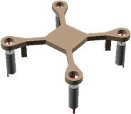

# QuadFrame
# Assembly Guide

## Bill of Materials

Make sure you have all of the following parts before you begin.

### Vitamins

Qty | Vitamin | Image
--- | --- | ---
4 | [CL072014 DC Motor]() |  | 

### Printed Parts

Qty | Part Name | Image
--- | --- | ---
1 | [Frame](../printedparts/stl/Frame.stl) |  | 

**Plastic Required**

6.0cm3, 0.01KG,  approx: 0.1 GBP

# Assembly Instructions

## Final Assembly

### Vitamins

Qty | Vitamin | Image
--- | --- | ---
4 | [CL072014 DC Motor]() |  | 

### Printed Parts

Qty | Part Name | Image
--- | --- | ---
1 | [Frame](../printedparts/stl/Frame.stl) |  | 

### Assembly Steps

1. Insert the motors

